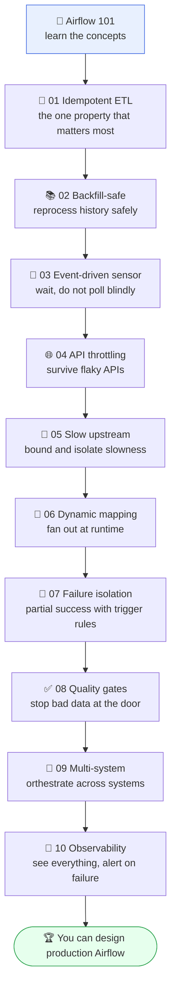
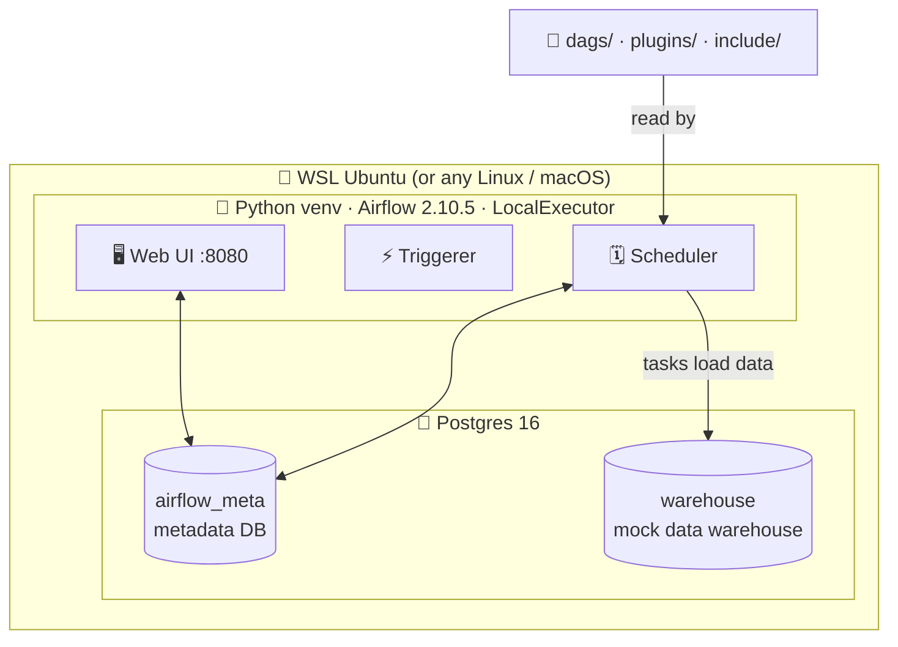

# 🌀 Airflow Production Patterns

[](https://github.com/Tharindi-W/airflow-production-patterns/actions/workflows/ci.yml)


> A hands-on, runnable catalogue of **10 production-grade Apache Airflow orchestration patterns**, built to take you from **beginner to pro**. Each pattern is a real problem a senior data engineer solves at a bank, telecom, or logistics platform, with a runnable DAG, a clear writeup of the tradeoffs, and a test that proves it works.

The value is in the patterns and the reasoning, not in any single dataset. A reviewer should walk away thinking "this person understands orchestration at scale, failure modes, and reliability", not "this person learned Airflow".

**Everything runs locally with no Docker and no cloud credentials.** Just Python and Postgres, natively.

---

## 📑 Table of contents

- [🎯 What is this?](#-what-is-this)
- [🧑‍🎓 Who is this for?](#-who-is-this-for)
- [🗺️ Learning path (beginner to pro)](#️-learning-path-beginner-to-pro)
- [🧠 New to Airflow? Start here](#-new-to-airflow-start-here)
- [🏗️ Architecture](#️-architecture)
- [⚡ Quickstart (no Docker)](#-quickstart-no-docker)
- [🗂️ The 10 patterns](#️-the-10-patterns)
- [🧭 Which pattern do I need?](#-which-pattern-do-i-need)
- [🧪 Testing and CI](#-testing-and-ci)
- [📁 Repo layout](#-repo-layout)
- [📚 Docs and resources](#-docs-and-resources)

---

## 🎯 What is this?

A catalogue of **8 to 10 orchestration patterns**, where each DAG is a design pattern, each folder is a real-world scenario, and each README explains the tradeoffs the way a consultant would. Every pattern folder answers four questions: **why this pattern exists**, **what breaks and when**, **why not the naive approach**, and **what a large org reaches for**.

It doubles as a tutorial. If you are new to Airflow, the guides below teach the concepts, and the patterns show them working on real problems.

## 🧑‍🎓 Who is this for?

- 🌱 **Beginners** who want to learn Airflow properly, by reading real DAGs instead of toy examples.
- 🌿 **Intermediate** engineers who can write a DAG but want the reliability patterns (idempotency, backfills, retries, quality gates).
- 🌳 **Advanced** engineers and reviewers who want a reference for how to think about failure modes and system design.

## 🗺️ Learning path (beginner to pro)

Follow the patterns in this order. Each builds on the mindset of the last.



## 🧠 New to Airflow? Start here

Read the primer once and everything else clicks:

➡️ **[docs/airflow_101.md](docs/airflow_101.md)** covers DAGs, tasks, operators, sensors, hooks, the scheduler, executors, XCom, trigger rules, and dynamic mapping, with links to the official docs.

Official docs to bookmark:
- 📖 [Apache Airflow documentation](https://airflow.apache.org/docs/apache-airflow/stable/index.html)
- 📖 [Core concepts](https://airflow.apache.org/docs/apache-airflow/stable/core-concepts/overview.html)
- 📖 [TaskFlow tutorial](https://airflow.apache.org/docs/apache-airflow/stable/tutorial/taskflow.html)

## 🏗️ Architecture

The whole stack is Airflow plus Postgres, running natively. No containers.



DAGs are read from this repo's `dags/` folder. Shared code lives in `include/` and `plugins/`. No data leaves your machine. Full detail in [docs/architecture.md](docs/architecture.md).

## ⚡ Quickstart (no Docker)

**Prerequisites:** a Linux shell with `python3` (3.11 or 3.12) and `sudo`. On Windows that means WSL2 with Ubuntu. Run everything from the repo root inside that shell.

```bash
# 1️⃣  Clone
git clone https://github.com/Tharindi-W/airflow-production-patterns.git
cd airflow-production-patterns

# 2️⃣  Copy the local env file (local dev credentials, not secrets)
cp .env.example .env

# 3️⃣  Install and initialise Postgres 16 (the only step that uses sudo)
./scripts/setup_postgres.sh

# 4️⃣  Create the venv, install pinned Airflow, init the metadata DB
./scripts/setup_airflow.sh

# 5️⃣  Start Airflow (scheduler + triggerer + web UI)
./scripts/start_airflow.sh
```

Then open 👉 **http://localhost:8080** and log in with the credentials from `.env` (default `admin` / `admin`). DAGs are paused by default: unpause one and trigger it.

Run a pattern from the command line:

```bash
source scripts/env.sh
airflow dags test idempotent_etl_pipeline 2024-01-01
```

Run the tests:

```bash
source scripts/env.sh
pytest tests/dag_validation -v          # fast checks, no database
pytest tests/acceptance -m acceptance -v # end-to-end proofs (needs Postgres)
```

## 🗂️ The 10 patterns

Each links to a focused, four-section README. ✅ = implemented, tested, and documented.

| # | Pattern | 💡 What it proves | 🕒 Use it when |
|---|---------|------------------|----------------|
| 🧱 [01](dags/01_idempotent_etl_pipeline/) | Idempotent ETL | Running the same load twice makes no duplicates | Any load that could be retried or re-run |
| 📚 [02](dags/02_backfill_safe_pipeline/) | Backfill-safe | Reprocessing a date never overwrites another | You reprocess history |
| 👀 [03](dags/03_event_driven_sensor_pattern/) | Event-driven sensor | Waits efficiently, proceeds when the event arrives | Work starts when data lands |
| 🌐 [04](dags/04_api_ingestion_with_throttling/) | API throttling | Survives 429 and 5xx with backoff | Pulling from a flaky or rate-limited API |
| 🐢 [05](dags/05_slow_upstream_handling/) | Slow upstream | A slow stage does not cascade | A source hangs or is unreliable |
| 🧬 [06](dags/06_dynamic_task_mapping/) | Dynamic mapping | N runtime inputs make N tasks | Number of work units unknown until runtime |
| 🧯 [07](dags/07_retries_and_failure_isolation/) | Failure isolation | Partial success with trigger rules | One branch may fail, the rest should go on |
| ✅ [08](dags/08_data_quality_gates/) | Quality gates | Bad batches are blocked before load | Bad data must never reach the warehouse |
| 🔗 [09](dags/09_multi_system_orchestration/) | Multi-system | API to store to warehouse to BI, end to end | A flow spans several systems |
| 🔔 [10](dags/10_production_monitoring_hooks/) | Observability | Failure and success callbacks fire well-formed alerts | You need alerting and visibility |

## 🧭 Which pattern do I need?

There is a full decision guide with a flowchart, a comparison matrix, and the pros, cons, and strengths of each pattern by data type, tool, and project type:

➡️ **[docs/when_to_use.md](docs/when_to_use.md)**

Most real pipelines combine several patterns at once (for example idempotency + throttling + quality gates + observability in one ingestion job).

## 🧪 Testing and CI

- 🟢 **DAG validation** (`tests/dag_validation`): imports every DAG, asserts no import errors and no cycles. Fast, no database.
- 🔵 **Acceptance tests** (`tests/acceptance`): each pattern's end-to-end proof against Postgres.
- 🤖 **[GitHub Actions CI](.github/workflows/ci.yml)** runs lint + DAG validation, and a full acceptance job with a Postgres service, on every push.

How it all fits together, and the reasoning behind the choices: ➡️ **[docs/how_it_was_built.md](docs/how_it_was_built.md)**

## 📁 Repo layout

```
airflow-production-patterns/
├── dags/            # one folder per pattern, each with a focused README
├── plugins/         # custom operators, custom sensors, reusable callbacks
├── include/         # shared python_utils, parameterised sql, configs
├── scripts/         # setup and run scripts (Postgres, Airflow, env)
├── tests/           # dag_validation (fast) + acceptance (end to end)
├── docs/            # primer, decision guide, architecture, how it was built
└── .github/         # CI workflow
```

## 📚 Docs and resources

| Guide | What it covers |
|-------|----------------|
| 🧠 [airflow_101.md](docs/airflow_101.md) | Airflow fundamentals for beginners, with official doc links |
| 🧭 [when_to_use.md](docs/when_to_use.md) | Which pattern to use, pros, cons, and strengths |
| 🏗️ [architecture.md](docs/architecture.md) | The local stack and how services connect |
| 🛠️ [how_it_was_built.md](docs/how_it_was_built.md) | Build story, testing strategy, CI, lessons learned |
| 📖 [patterns.md](docs/patterns.md) | Deeper writeups for all ten patterns |
| 🗃️ [pattern_catalog.md](docs/pattern_catalog.md) | One-line handbook of every pattern |
| 🧯 [failure_modes.md](docs/failure_modes.md) | Cross-pattern table of failure scenarios |

## ✍️ Conventions

- Anything mocked is labelled as a mock. Nothing fake is presented as real.
- Every pattern is runnable locally end to end. No pattern is documentation only.
- Exact pinned versions in `requirements.txt`. No floating `latest`.
- No em dashes anywhere. A pre-commit hook enforces it.
