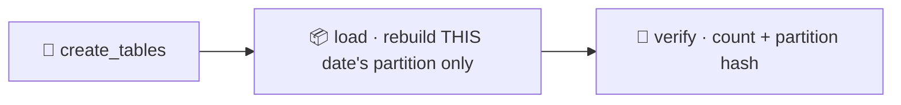

# Pattern 02: Backfill-Safe Pipeline

Historical reprocessing must not corrupt data. When you backfill a month of history, each day must land in its own place and leave every other day exactly as it was. This pattern makes that guarantee structural rather than hopeful.



- DAG id: `backfill_safe_pipeline`
- Target: `core.daily_sales`, primary key `(load_date, region)`
- `catchup=False`, so backfills are deliberate, not automatic

## Why this pattern exists

Reprocessing history is routine: a bug in a transform is fixed and last quarter must be recomputed, a late-arriving correction reopens a range of days, or a downstream consumer asks for a schema change applied retroactively. The danger is that a reprocessing job written casually will reload the whole table, or will compute one date but write with the wrong scope and clobber adjacent dates.

Two decisions prevent that:

1. `catchup=False`. When the DAG is unpaused it does not immediately try to run every date between its start date and today. That default alone prevents the classic accident where turning a DAG on triggers hundreds of unintended runs. Backfills become an explicit command (`airflow dags backfill -s ... -e ...`).
2. Partition-scoped writes keyed on the logical date. Every run deletes and reinserts only its own `load_date` partition. The primary key `(load_date, region)` means a run for one date physically cannot write into another date's rows.

Together these turn a backfill into a set of independent, repeatable, single-partition rebuilds.

## Failure modes (what breaks and when)

- Accidental catchup stampede. Without `catchup=False`, unpausing a DAG with an old start date floods the scheduler with runs. Here it does nothing until you ask for a backfill.
- Wrong-scope write. A naive job that does `TRUNCATE core.daily_sales; INSERT ...` while intending to fix one day destroys every other day. Here the delete is `WHERE load_date = :ds`, so the blast radius is exactly one partition.
- Overlapping backfill and scheduled run. If a scheduled run for today and a backfill for today execute close together, both target the same single partition and the operation is idempotent, so the partition ends in a correct, consistent state either way.
- Partial backfill interrupted. If a range backfill dies halfway, the dates that completed are correct and the rest simply have not run yet. Re-running the range rebuilds each date cleanly because each is independent.

The acceptance test exercises the core claim directly: it backfills three dates, re-runs the middle one, and asserts the neighbours are byte-for-byte unchanged.

## Tradeoffs (why not the naive linear DAG)

The naive approach is a single job that rebuilds the whole table. It is simpler and it is dangerous: every reprocessing touches all history, so the cost and the blast radius grow with the size of the table, and one mistake corrupts everything.

Partitioned, date-scoped loads cost a little more structure (a partition key, a scoped delete) and give you:

- Bounded work: reprocessing a day touches one day.
- Bounded risk: a bad run can only damage the partition it targeted.
- Parallelism: independent partitions can be backfilled concurrently.

The main tradeoff is that you must decide the partition grain up front (here, one day) and stick to it. If the grain is wrong for the query patterns, you pay for it later.

## Production alternatives (what a large org reaches for)

- Native table partitioning. Postgres declarative partitioning, or partitioned tables in BigQuery, Snowflake, or Redshift, where you can atomically swap or truncate a single partition.
- Warehouse `MERGE` on the partition key, or dbt incremental models configured with a partition or `unique_key`, which generate the scoped merge for you.
- Lakehouse formats (Delta, Iceberg, Hudi) with partition overwrite modes (for example Spark `replaceWhere` or dynamic partition overwrite) that rebuild a partition atomically on object storage.

This pattern uses a plain primary key and a scoped delete-then-insert because it runs locally, but the idea (own your partition, never reach outside it) is exactly what those systems formalise.

## Run it

```bash
source scripts/env.sh

# Controlled backfill of a date range
airflow dags backfill -s 2024-03-01 -e 2024-03-03 backfill_safe_pipeline

# Or prove partition independence with the acceptance test
pytest tests/acceptance/test_pattern_02_backfill.py -m acceptance -v
```
