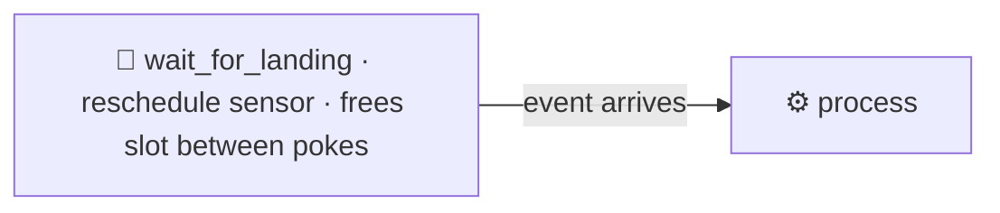

# Pattern 03: Event-Driven Sensor Pattern

Pipelines often cannot start until something external arrives: a file lands, an object appears in a bucket, an upstream job signals completion. The naive answer is a fixed schedule plus hope. The better answer is to wait for the event, efficiently, and proceed the moment it arrives.



- DAG id: `event_driven_sensor_pattern`
- Custom sensor: `plugins/custom_sensors/landing_sensor.py` (`LandingPartitionSensor`)
- Event simulation: `python scripts/drop_landing_file.py <YYYY-MM-DD>`

## Why this pattern exists

Two bad habits show up when people first handle external dependencies:

1. Guess-and-schedule. Run the pipeline at 06:00 because the file "usually" lands by 05:30. When the upstream is late, the run reads stale or missing data and either fails loudly or, worse, succeeds quietly on incomplete input.
2. Busy-wait. Loop and sleep inside a task, holding a worker slot the entire time. A handful of these and the pool is exhausted, starving every other task.

A sensor in reschedule mode fixes both. It checks for the event on a cadence, and between checks it gives the worker slot back to the pool. The DAG proceeds within one poke interval of the event actually arriving, not at a guessed time, and it costs almost nothing while waiting.

The sensor here is deliberately a real custom sensor, not a FileSensor alias: it resolves a landing directory, derives a per-date marker name, and treats a zero-byte file as not ready so a partially written marker does not trigger a premature run.

## Poke vs reschedule vs deferrable

- poke mode: the sensor holds its worker slot for its entire life, sleeping between checks. Simple, but it ties up a slot. Fine for very short waits.
- reschedule mode (used here): between checks the task instance is released and put back to sleep by the scheduler, freeing the slot. Best for waits of minutes to hours with many concurrent sensors. The tradeoff is a small scheduler overhead per reschedule and a minimum granularity of the poke interval.
- deferrable (async triggers): the wait is handed to the triggerer process, which watches many events on an async event loop and wakes the task when the condition is met. The most scalable option for thousands of concurrent waits, at the cost of writing or using a trigger and running a triggerer. This repo runs a triggerer, so deferring is a natural next step for high fan-in waits.

## Failure modes (what breaks and when)

- Event never arrives. The sensor hits its timeout and fails cleanly, rather than hanging forever. Here `timeout` is set to 10 minutes.
- Partial write. Upstream creates the marker before it has finished writing the data. Treating an empty marker as not ready avoids consuming a half-written signal. In production you would signal readiness with a separate atomic marker written last.
- Slot exhaustion under poke mode. Many long poke-mode sensors can drain the worker pool. Reschedule mode is the mitigation.
- Clock and timezone drift with guess-and-schedule. Event-driven waiting removes the dependency on a guessed time entirely.

The acceptance test drives the sensor directly: `poke()` returns False before the marker exists and True once it does, and an empty marker is rejected.

## Tradeoffs (why not the naive linear DAG)

A fixed-schedule linear DAG is simpler and is fragile against timing. Sensors add a moving part (the wait) and a couple of parameters to tune (poke interval, timeout), and in exchange the pipeline becomes correct with respect to when data actually arrives instead of when you hoped it would. The main risk to manage is an unbounded or mistuned wait, which is why a sane timeout is mandatory, not optional.

## Production alternatives (what a large org reaches for)

- Deferrable sensors and the triggerer for large numbers of concurrent waits.
- Native event triggers: S3 event notifications to SQS or SNS, GCS Pub/Sub notifications, or a cloud function that triggers the DAG via the Airflow REST API, so there is no polling at all.
- Datasets and data-aware scheduling in Airflow, where a DAG is scheduled by the update of a dataset another DAG produces, replacing cross-DAG sensors.
- A message queue or streaming platform (Kafka, Pub/Sub) when the trigger is a continuous stream of events rather than a per-partition file drop.

## Run it

```bash
source scripts/env.sh

# Terminal 1: start Airflow and trigger the DAG (it will wait)
#   in the UI unpause event_driven_sensor_pattern and trigger a run

# Terminal 2: simulate the event so the DAG proceeds
python scripts/drop_landing_file.py 2024-05-01

# Or prove wait-then-proceed with the acceptance test
pytest tests/acceptance/test_pattern_03_sensor.py -m acceptance -v
```
