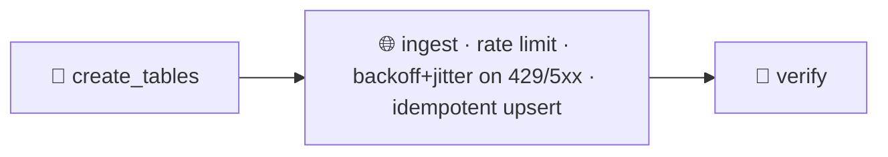

# Pattern 04: API Ingestion with Throttling

External APIs throttle and fail. Pull from one naively and the first burst of 429 Too Many Requests or a transient 5xx takes your pipeline down and pages someone at 3am. This pattern absorbs that turbulence automatically.



- DAG id: `api_ingestion_with_throttling`
- Custom operator: `plugins/custom_operators/resilient_api_operator.py` (`ThrottledApiIngestOperator`)
- Mock API: `include/python_utils/mock_api.py` (labelled mock, injects 429 and 503)

## Why this pattern exists

Every real API has limits and bad days. Rate limits return 429, overloaded backends return 503, and network blips happen. A pull job that treats the first non-200 as fatal will fail constantly for reasons that are entirely normal and entirely temporary. The fix is to expect transient failure and handle it in the client:

- Client-side rate limiting spaces out requests so you stay under the limit and avoid provoking 429s at all.
- Exponential backoff with jitter retries a failed call after a growing, randomised delay. The growth keeps you from hammering a struggling server, and the jitter keeps many clients from retrying in lockstep (the thundering herd).
- Idempotent upsert by primary key means a retry that partially succeeded, or a whole task retried by Airflow, never creates duplicate rows.

Structured logging on every retry makes the behaviour observable: you can see in the task log exactly how many times each page was throttled and how long the backoff waited.

## Failure modes (what breaks and when)

- Burst of 429s. The mock injects a 429 on the first attempt of each page. The client backs off and retries, and the pull completes with no human intervention. This is exactly what the acceptance test asserts.
- Transient 5xx. The mock injects a 503 on the second attempt. Same handling: retried, absorbed.
- Persistent failure. If a call keeps failing past the retry budget, `retry_with_backoff` gives up and raises, and Airflow's task-level retries take over, and finally the task fails visibly rather than hanging. Failure is surfaced, not hidden.
- Duplicate delivery on retry. If the operator is retried after a partial load, the primary key upsert makes the re-pull a no-op on row count.
- Thundering herd. Without jitter, many workers retel at the same instants and re-overload the server. Jitter in the backoff spreads them out.

## Tradeoffs (why not the naive linear DAG)

A naive `GET then insert` is a few lines and is brittle: it fails on the first 429 and it duplicates on retry. Resilient ingestion costs a rate limiter, a retry policy with a few parameters to tune (retries, base delay, max delay, jitter), and an idempotent upsert. In return the pull survives the normal turbulence of real APIs unattended.

The parameters do need judgement. Too few retries and you fail on normal throttling, too many and a genuinely broken upstream keeps you retrying for a long time before the failure surfaces. A max delay and a bounded retry count keep that in check.

## Production alternatives (what a large org reaches for)

- A real HTTP client with a retry adapter: `requests` with `urllib3` `Retry` (respecting `Retry-After` on 429), or `tenacity` for the backoff policy.
- Honouring server signals: read the `Retry-After` header and rate-limit headers instead of guessing the interval.
- Provider hooks and deferrable operators: the Airflow HTTP provider, or deferrable operators that wait asynchronously so a long backoff does not hold a worker slot.
- A dedicated ingestion service or tool (Airbyte, Fivetran, Meltano) when the connector catalogue and incremental state management are worth outsourcing.

This pattern implements the core ideas directly against a mock so it runs offline, but the shape (rate limit, backoff with jitter, idempotent load, honour retries) is exactly what those tools do for you.

## Run it

```bash
source scripts/env.sh

airflow dags test api_ingestion_with_throttling 2024-06-01

# Or run the acceptance test (unit checks plus the end-to-end survival test)
pytest tests/acceptance/test_pattern_04_api.py -m acceptance -v
```
