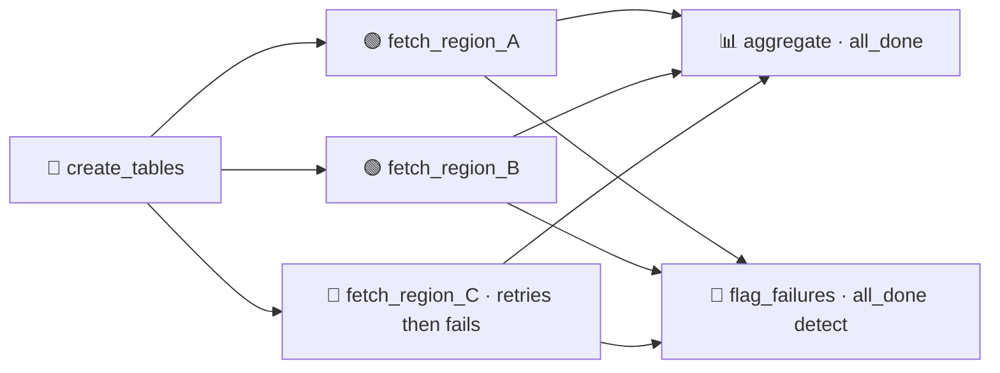

# Pattern 07: Retries and Failure Isolation

When a pipeline fans out across many independent units of work, one unit failing should not take the whole run down with it. The healthy work should complete, the failure should be contained, and someone should be told. Trigger rules are how Airflow expresses that.



- DAG id: `retries_and_failure_isolation`
- Trigger rules: `all_done` for both the aggregate and the failure detector
- Tables: `core.region_load` (per region), `core.run_events` (markers)

## Why this pattern exists

The default trigger rule, `all_success`, is strict: a task runs only if every upstream succeeded. That is the right default for a strict chain, but it is wrong for fan-out. If you load ten regions and one fails, `all_success` skips the aggregate entirely, throwing away nine good regions because of one bad one. That is fragile, not safe.

Real systems want partial success. Trigger rules express it:

- `all_done` on the aggregate: run once the upstreams have finished, whatever their outcome. The aggregate then works with the regions that succeeded and simply notes the ones that did not. Nine good regions still get aggregated.
- `all_done` on the failure detector: run once the branches settle, inspect the result, and flag any region that did not arrive. This is where you raise an alert, write an incident record, or trigger a compensating action, only when there was a failure.

There is also `one_failed`, which runs a branch the moment any upstream fails. It is the idiomatic event-driven way to fire a failure handler. This repo uses an `all_done` detector instead for a deterministic, self-contained demo (a `one_failed` branch depends on the scheduler evaluating it at exactly the right moment, which is fine in a live deployment but harder to pin down in a short automated test).

Per-task retries sit underneath this. The failing region here has its own retry budget, so a transient issue gets a second chance before the failure is finally accepted and isolated. Retries handle the transient; trigger rules handle the permanent.

The acceptance test forces region C to fail and asserts the shape of the outcome: A and B are loaded, C recorded nothing, the aggregate ran on the survivors, and the failure was flagged.

## Failure modes (what breaks and when)

- One unit fails. With `all_success` the whole downstream is skipped. With `all_done` the aggregate still runs on the survivors. This is the core fix.
- Silent partial data. The aggregate records which regions it actually had, so a consumer can tell the difference between "all regions" and "all regions except C". Partial success is only safe if it is visible.
- No failure signal. Without a `one_failed` branch, a partial failure can pass unnoticed because the run still ended in success. The failure handler guarantees a signal.
- Retry storms on a permanent failure. Retries help transient issues but waste time on permanent ones. A bounded retry count (here one retry) keeps the failure from being retried forever before it is isolated.

## Tradeoffs (why not the naive linear DAG)

A naive DAG treats the whole fan-out as all-or-nothing: simple, and it discards good work on any single failure. Trigger rules add a few concepts to learn (`all_done`, `one_failed`, `none_failed_min_one_success`) and a small amount of extra structure, in exchange for graceful degradation and an explicit failure path.

The tradeoff to manage is that partial success must be intentional. If downstream consumers assume completeness, silently aggregating a subset is worse than failing loudly. The rule of thumb: use partial success only where the aggregate and its consumers can tolerate and can see missing pieces.

## Production alternatives (what a large org reaches for)

- The full set of trigger rules, including `none_failed_min_one_success` for "proceed if nothing failed and at least one thing ran", and `all_skipped`, for finer control.
- Branching with `BranchPythonOperator` or `@task.branch` to choose a path explicitly rather than reacting to failure.
- Setup and teardown tasks (Airflow 2.7 and later) for resources that must be cleaned up regardless of success.
- A dedicated alerting and incident path (PagerDuty, Opsgenie) wired into the `one_failed` branch, or the callbacks from Pattern 10.

## Run it

```bash
source scripts/env.sh

# Run through the scheduler so trigger-rule isolation applies
airflow dags backfill -s 2024-09-15 -e 2024-09-15 --reset-dagruns -y retries_and_failure_isolation

# Or run the acceptance test
pytest tests/acceptance/test_pattern_07_failure_isolation.py -m acceptance -v
```
