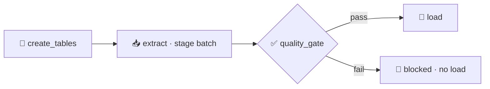

# Pattern 08: Data Quality Gates

Bad data is worse than no data. A load that quietly ingests nulls, negative amounts, or a truncated batch corrupts every downstream report and is often noticed only after someone makes a decision on it. A quality gate stops the bad batch at the door.



- DAG id: `data_quality_gates`
- Checks: row count, not-null on required columns, non-negative amount
- Gate util: `include/python_utils/quality.py`

## Why this pattern exists

Data pipelines fail in two ways. The loud way is an exception, and it is the safe way, because someone notices. The quiet way is bad data that loads successfully: a batch that came through half empty, a null where a key should be, a negative amount from an upstream bug. Nothing errors, the warehouse fills with garbage, and the failure surfaces days later as a wrong number in a report.

A quality gate converts the quiet failure into a loud one, on purpose. The batch is staged first, then a gate task runs explicit checks against staging:

- Row count: did we get a plausible number of rows, or did the batch arrive empty or truncated?
- Not-null: are the columns that must be present actually present?
- Domain checks: are amounts non-negative, are enumerations valid, do dates fall in range?

If any check fails, the gate task raises and fails. Because the load task is downstream of the gate with the default `all_success` trigger rule, a failed gate means the load never runs. The bad batch sits in staging for inspection and never touches the final table.

The acceptance test runs both paths: a good batch passes the gate and loads, and a bad batch (a null customer id injected on purpose) is staged but blocked, so the final table stays empty for that date.

## Failure modes (what breaks and when)

- Empty or truncated batch. The row-count check catches a batch that arrived with too few rows before it dilutes the warehouse.
- Missing required fields. The not-null checks catch nulls in columns a downstream join or metric depends on.
- Out-of-domain values. The non-negative check catches an upstream sign error. The same shape extends to range checks, allowed-value checks, and referential checks.
- Gate passes but load fails on constraints. The final table's NOT NULL columns are a backstop. If something slips past the gate, the database still refuses it, so the worst case is a loud failure, not silent corruption.
- Bad batch stuck in staging. Staging holds the rejected batch for inspection. A re-run with corrected data replaces that date's staging slice.

## Tradeoffs (why not the naive linear DAG)

A naive `extract then load` is simpler and trusts the input completely. Gates cost a staging step and a set of checks you have to write and maintain, and they cost a decision about what "good" means for each dataset. In return you get a warehouse you can trust, and failures that show up at load time instead of in a board meeting.

The tradeoff to manage is gate strictness. Too loose and bad data slips through; too strict and normal variation trips the gate and blocks good loads. Checks should encode real invariants, not incidental properties of yesterday's data.

## Production alternatives (what a large org reaches for)

- Declarative data quality frameworks: Great Expectations, Soda, or dbt tests, which express checks as configuration and produce validation reports.
- Airflow's SQL check operators: `SQLColumnCheckOperator` and `SQLTableCheckOperator` from the common SQL provider, which wrap exactly this pattern.
- Contract testing at the boundary, so a producer cannot publish a batch that violates the agreed schema in the first place.
- Quarantine tables and dead-letter queues, so rejected records are captured and triaged rather than discarded.

## Run it

```bash
source scripts/env.sh

# Good batch: passes the gate and loads
airflow dags test data_quality_gates 2024-10-01

# Bad batch: the gate blocks the load
PATTERNS_INJECT_BAD_BATCH=1 airflow dags backfill \
  -s 2024-10-05 -e 2024-10-05 --reset-dagruns -y data_quality_gates

# Or run the acceptance test (both paths)
pytest tests/acceptance/test_pattern_08_quality.py -m acceptance -v
```
