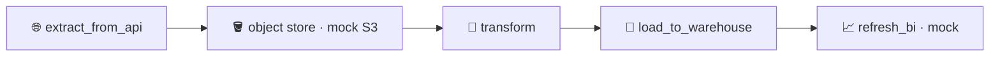

# Pattern 09: Multi-System Orchestration

A pipeline of any real ambition spans several systems: an API, an object store, a transform engine, a warehouse, a BI tool. Orchestrating that is system thinking, not task thinking. The job of the orchestrator is to move data across those boundaries reliably, with each hop behind a clear interface so any single system can be swapped or mocked.



- DAG id: `multi_system_orchestration`
- Object store: `include/python_utils/mock_object_store.py` (labelled mock for S3/GCS)
- Lands in: `core.curated_orders`, with a `core.bi_refreshes` marker

## Why this pattern exists

The hard part of a multi-system flow is not any one step, it is the boundaries between them. Each hop is a place where formats change, where a system can be down, and where a naive design couples everything together so tightly that you cannot test or replace one piece without touching all of them.

This pattern keeps the hops behind interfaces:

- The API extract produces raw records and hands them to the object store. It does not know or care what happens next.
- The object store is a put/get/exists interface. Here it is a local file-backed mock; in production it is S3 or GCS. Nothing downstream changes when you swap the implementation.
- The transform reads raw from the store, computes the curated shape, and writes curated back to the store. It talks only to the store, not to the API or the warehouse.
- The warehouse load reads curated from the store and upserts idempotently by primary key.
- The BI refresh is the final hop, recorded as a marker so the end of the chain is observable.

Because each boundary is an interface, the whole chain runs locally with mocks and no credentials, and each system could be replaced independently. The acceptance test runs the entire flow and asserts the curated data landed in the warehouse and the BI refresh fired.

## Failure modes (what breaks and when)

- A middle system is down. Each hop is its own task with its own retries, so a transient object-store or warehouse blip is retried without re-running the whole chain from the API.
- Format drift at a boundary. Because raw and curated are distinct, explicit shapes written to the store, a change in the API's format is contained at the transform step rather than silently propagating to the warehouse.
- Partial progress. Intermediate artifacts (raw and curated objects) persist in the store, so a re-run can resume from a known point rather than repeating expensive upstream calls. The warehouse load is an idempotent upsert, so re-running it is safe.
- Tight coupling. If the transform talked directly to the API and the warehouse, you could not test it in isolation or swap either side. The store-in-the-middle design keeps the blast radius of any change small.

## Tradeoffs (why not the naive linear DAG)

A naive DAG passes data straight from step to step in memory or XCom and couples every system to its neighbours. It is simpler for a toy flow and it does not scale: XCom is not meant for large payloads, there are no resumable intermediates, and a change to one system ripples through the rest. Staging through an object store costs extra reads and writes and a little more code, and gives you resumability, decoupling, and the ability to mock or replace any hop.

The tradeoff to manage is the extra storage and the need to manage intermediate artifacts (naming, lifecycle, cleanup). For anything beyond trivial volumes that cost is well worth paying.

## Production alternatives (what a large org reaches for)

- Real object storage via provider hooks: the Amazon S3, Google Cloud Storage, or Azure Blob providers in place of the local mock.
- A transform engine for the middle hop: Spark, dbt, or a warehouse-native transform, rather than in-process Python.
- Datasets and data-aware scheduling to connect independently owned DAGs across systems, instead of one monolithic DAG.
- A real BI refresh via the tool's API (Tableau, Power BI, Looker) in place of the mock marker.

## Run it

```bash
source scripts/env.sh

airflow dags test multi_system_orchestration 2024-11-01

pytest tests/acceptance/test_pattern_09_multisystem.py -m acceptance -v
```
