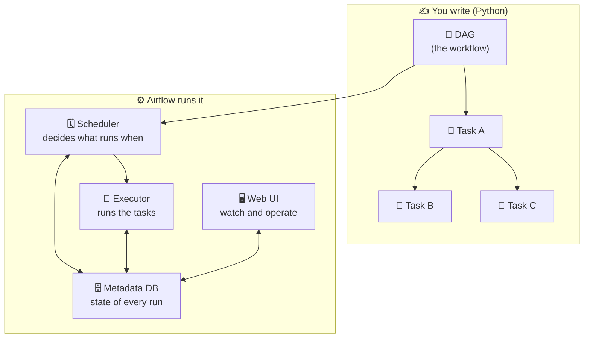

# 🧠 Airflow 101: the concepts you need

New to Airflow? Read this once and the patterns in this repo will make sense. It is a fast, practical tour of the ideas, with links to the official docs for depth.

Official starting points:
- 📖 [Apache Airflow documentation](https://airflow.apache.org/docs/apache-airflow/stable/index.html)
- 📖 [Core concepts overview](https://airflow.apache.org/docs/apache-airflow/stable/core-concepts/overview.html)
- 📖 [Fundamental concepts tutorial](https://airflow.apache.org/docs/apache-airflow/stable/tutorial/fundamentals.html)

## 🌀 What is Airflow?

Apache Airflow is a tool for authoring, scheduling, and monitoring workflows as code. You describe a workflow in Python, Airflow works out the order of steps, runs them on a schedule (or on demand), retries them when they fail, and gives you a UI to watch it all. It is an orchestrator: it does not usually move or crunch the data itself, it tells other systems when and in what order to do their work.

Think of it as a very reliable, very observable cron with dependencies, retries, backfills, and a UI.

## 🧩 The core building blocks



- 📄 **DAG (Directed Acyclic Graph)**: the workflow itself. "Directed" means steps have a direction (A then B), "acyclic" means no loops. One DAG file defines one workflow. 📖 [DAGs](https://airflow.apache.org/docs/apache-airflow/stable/core-concepts/dags.html)
- 🔹 **Task**: a single step in the DAG. Tasks have dependencies (`a >> b` means "b after a"). 📖 [Tasks](https://airflow.apache.org/docs/apache-airflow/stable/core-concepts/tasks.html)
- 🧰 **Operator**: the template that defines what a task does. `PythonOperator` runs Python, `BashOperator` runs a shell command, provider operators talk to Postgres, S3, Snowflake, and so on. An operator you instantiate becomes a task. 📖 [Operators](https://airflow.apache.org/docs/apache-airflow/stable/core-concepts/operators.html)
- 👀 **Sensor**: a special operator that waits for something to happen (a file lands, a partition appears) before letting the DAG continue. 📖 [Sensors](https://airflow.apache.org/docs/apache-airflow/stable/core-concepts/sensors.html)
- 🔌 **Hook**: a reusable client for an external system (for example `PostgresHook`). Operators use hooks under the hood. 📖 [Connections and hooks](https://airflow.apache.org/docs/apache-airflow/stable/authoring-and-scheduling/connections.html)
- 🗓️ **Scheduler**: the process that reads your DAGs, decides which task instances are ready, and queues them. 📖 [Scheduler](https://airflow.apache.org/docs/apache-airflow/stable/administration-and-deployment/scheduler.html)
- 🏃 **Executor**: how tasks actually run. `SequentialExecutor` (one at a time, SQLite), `LocalExecutor` (parallel, on one machine, used in this repo), `CeleryExecutor` and `KubernetesExecutor` (distributed). 📖 [Executor](https://airflow.apache.org/docs/apache-airflow/stable/core-concepts/executor/index.html)
- 🗄️ **Metadata database**: where Airflow stores the state of every DAG run and task instance. This repo uses Postgres for it.

## 🐍 Two ways to write a DAG

**Classic operators**: instantiate operator objects and wire them with `>>`.

**TaskFlow API** (used throughout this repo): decorate plain Python functions with `@task`, and return values flow between them automatically. It reads like normal code. 📖 [TaskFlow tutorial](https://airflow.apache.org/docs/apache-airflow/stable/tutorial/taskflow.html)

```python
@dag(schedule="@daily", start_date=..., catchup=False)
def my_pipeline():
    @task
    def extract(): return [1, 2, 3]

    @task
    def load(rows): print(sum(rows))

    load(extract())

my_pipeline()
```

## 🔑 Concepts the patterns lean on

- 📅 **Logical date / data interval**: every run represents a slice of time (its `ds`, like `2024-01-01`). Good pipelines scope their work to that slice. 📖 [DAG runs](https://airflow.apache.org/docs/apache-airflow/stable/authoring-and-scheduling/dag-run.html)
- ⏮️ **catchup and backfill**: `catchup=False` stops a DAG from auto-running every past date when you turn it on. `backfill` deliberately re-runs a date range. Patterns [02](../dags/02_backfill_safe_pipeline/) and the isolation tests use these.
- 📨 **XCom**: the small message bus tasks use to pass values (return values in TaskFlow). Keep payloads small. 📖 [XComs](https://airflow.apache.org/docs/apache-airflow/stable/core-concepts/xcoms.html)
- 🔁 **Retries**: a task can retry on failure with a delay. Set per task, because a transient API blip and a data quality failure deserve different policies (see patterns [04](../dags/04_api_ingestion_with_throttling/) and [08](../dags/08_data_quality_gates/)).
- 🚦 **Trigger rules**: decide when a task runs based on its upstreams. Default is `all_success`. `all_done` runs regardless of outcome, `one_failed` runs when something fails. Pattern [07](../dags/07_retries_and_failure_isolation/) is all about these. 📖 [Trigger rules](https://airflow.apache.org/docs/apache-airflow/stable/core-concepts/dags.html#trigger-rules)
- 🧬 **Dynamic task mapping**: create N tasks at runtime from runtime data with `.expand()`. Pattern [06](../dags/06_dynamic_task_mapping/). 📖 [Dynamic task mapping](https://airflow.apache.org/docs/apache-airflow/stable/authoring-and-scheduling/dynamic-task-mapping.html)
- ⏳ **poke / reschedule / deferrable**: three ways a sensor can wait, from cheapest-to-write to most scalable. Pattern [03](../dags/03_event_driven_sensor_pattern/). 📖 [Deferrable operators](https://airflow.apache.org/docs/apache-airflow/stable/authoring-and-scheduling/deferring.html)
- 🔔 **Callbacks**: functions Airflow calls on success or failure, used for alerting. Pattern [10](../dags/10_production_monitoring_hooks/). 📖 [Callbacks](https://airflow.apache.org/docs/apache-airflow/stable/administration-and-deployment/logging-monitoring/callbacks.html)
- 🧱 **Idempotency**: running the same step twice leaves the same result. The single most important property for reliable pipelines. Pattern [01](../dags/01_idempotent_etl_pipeline/).

## 🖥️ How you run and watch it

- The **web UI** (this repo serves it at http://localhost:8080) shows every DAG, run, task, and log. Grid and Graph views are where you live day to day.
- `airflow dags test <dag_id> <date>` runs a whole DAG once, in process, great for quick checks.
- `airflow dags backfill -s <start> -e <end> <dag_id>` runs a date range through the real scheduler.

Next: see [when_to_use.md](when_to_use.md) to map a real problem to the right pattern, or jump into [Pattern 01](../dags/01_idempotent_etl_pipeline/) to see all of this in action.
