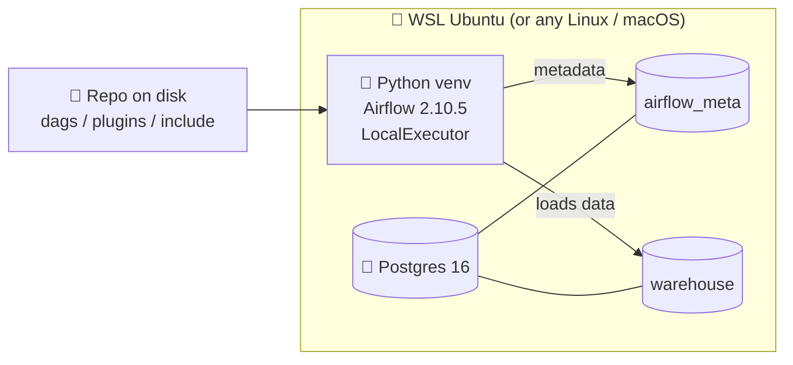
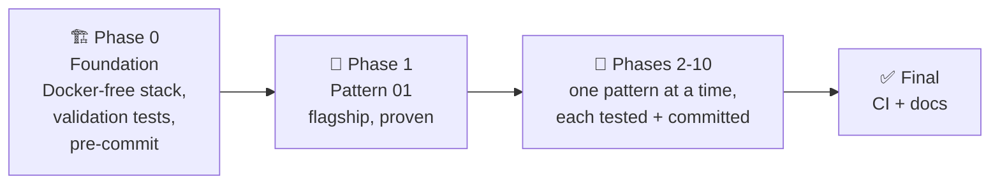

# 🛠️ How this project was built

This repo is not a toy. Every DAG runs, every claim has a test, and the whole thing is reproducible on a laptop with no Docker and no cloud account. This page explains the decisions behind it, so you can build the same way.

## 🎯 Goals

1. **Runnable, not just readable.** Every pattern executes end to end locally and proves its claim with an acceptance test.
2. **Reproducible with zero cost.** No Docker, no cloud credentials, no paid services. Just Python and Postgres.
3. **Beginner-to-pro.** Enough context to learn from, enough rigour to respect.

## 🧱 The stack (and why)

- **Airflow 2.10.5**, pinned to the exact patch, installed from the official constraints file so dependency resolution is deterministic. Airflow 2.x is what most employers run.
- **LocalExecutor + Postgres metadata DB** instead of SequentialExecutor + SQLite, so tasks run in parallel and patterns like dynamic mapping and failure isolation actually demonstrate something.
- **A separate `warehouse` Postgres database** as a labelled mock for a real analytical warehouse (Snowflake, BigQuery, Redshift).
- **No Docker.** Airflow and Postgres run as native processes. This trades a one-time scripted Postgres install for zero container tooling and fully visible moving parts. See [architecture.md](architecture.md).

## 🗺️ The build order

The project was built in phases, each verified before the next, exactly as you would ship real infrastructure.

Each pattern was only considered done when it passed the DAG-validation suite **and** its own acceptance test ran green against real Postgres, and then it was committed and pushed on its own.

## 🧪 Testing strategy

Two layers, on purpose:

- **DAG validation** (`tests/dag_validation`): fast, no database. Imports every DAG and asserts no import errors, no cycles, and basic hygiene (tags, integer retries). This is the gate every pattern must pass and it runs in CI without Postgres.
- **Acceptance tests** (`tests/acceptance`): each pattern's real proof, run end to end against Postgres. Marked with a pytest marker so they are separate from the lightweight suite.

A subtle but important lesson lives in `tests/acceptance/_runners.py`:

- `airflow dags test` runs a DAG in process and is great when every task should succeed, but it **aborts on the first task failure**, so it cannot demonstrate downstream trigger-rule isolation.
- `airflow dags backfill` runs through the scheduler with the LocalExecutor and **continues past a failed task**, running `all_done` branches. So the isolation and failure patterns (05, 07, 08) test via backfill.

## 🤖 Continuous integration

The [CI workflow](../.github/workflows/ci.yml) has two jobs:

1. **Lint and DAG validation**: ruff, black, and the DAG-integrity suite. No database needed.
2. **Acceptance (end to end with Postgres)**: spins up a Postgres service container, creates the two databases, runs `airflow db migrate`, and executes every acceptance test end to end.

So every push proves not just that the DAGs parse, but that all ten patterns still work.

## 🧯 A few real bugs found by actually running it

Building this surfaced genuine issues that reading alone would not:

- An `env.sh` that broke under `set -u` because `PYTHONPATH` was unset.
- A `one_failed` failure handler that was flaky under backfill (the failing task passes through `up_for_retry` first), replaced with a deterministic `all_done` detector.
- An invalid CI workflow that used the `runner` context in job-level `env`, where it is not available.

That is the point of the "everything must run" rule: it turns silent design flaws into loud, fixable failures.

## ✍️ Conventions

- No em dashes anywhere. Use commas, colons, or parentheses. A pre-commit hook enforces it.
- Anything mocked is labelled a mock, so nothing is presented as a real integration that is not.
- Type hints, docstrings, pinned versions, and a consistent module layout throughout.
