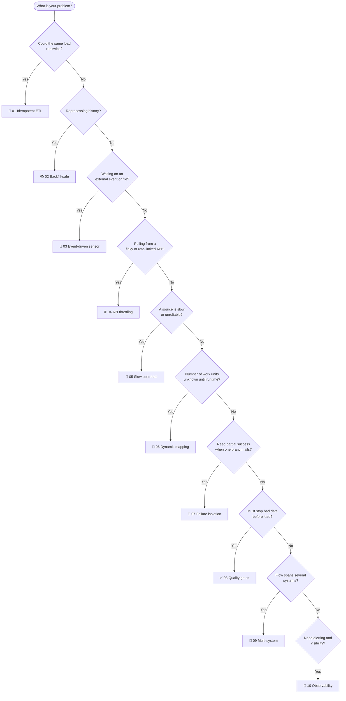

# 🧭 Which pattern do I need?

Every pattern here answers a real production question. This guide maps your situation to the right one, and is honest about the strengths, the costs, and where each shines depending on your data, your tools, and your project.

## 🌳 Decision guide

Most real pipelines combine several of these. A production ingestion often uses 01 (idempotency) plus 04 (throttling) plus 08 (quality gates) plus 10 (observability) at once.

## 📊 Pattern comparison at a glance

| # | Pattern | Use it when | Core Airflow feature | Cost / complexity |
|---|---------|-------------|----------------------|-------------------|
| 🧱 01 | Idempotent ETL | Any load that could be retried or re-run | Upsert + execution-date scoping | Low |
| 📚 02 | Backfill-safe | You reprocess history | `catchup=False`, partitioned writes | Low |
| 👀 03 | Event-driven sensor | Work starts when data arrives | Sensors (reschedule mode) | Medium |
| 🌐 04 | API throttling | Source API throttles or fails | Retries, backoff, custom operator | Medium |
| 🐢 05 | Slow upstream | A source hangs or is slow | `execution_timeout`, trigger rules | Medium |
| 🧬 06 | Dynamic mapping | Unknown number of inputs | `.expand()` dynamic mapping | Medium |
| 🧯 07 | Failure isolation | One branch may fail, rest should go on | Trigger rules, per-task retries | Medium |
| ✅ 08 | Quality gates | Bad data must not load | Gate task that fails before load | Low |
| 🔗 09 | Multi-system | Flow crosses many systems | Interfaces + staging in a store | High |
| 🔔 10 | Observability | You need alerts and visibility | Callbacks + notifier | Low |

## 🔬 Strengths, tradeoffs, and where each shines

### 🧱 01 Idempotent ETL
- **Strength**: makes a re-run a safe no-op, so recovery is "just run it again".
- **Tradeoff**: needs a primary key and an upsert, slightly slower than a blind append.
- **Best for**: any warehouse load. **Data**: keyed records (orders, events, customers). **Tools**: Postgres `ON CONFLICT`, Snowflake/BigQuery `MERGE`, dbt incremental, Delta/Iceberg `MERGE INTO`.

### 📚 02 Backfill-safe
- **Strength**: reprocessing one date touches only that date, bounding both work and blast radius.
- **Tradeoff**: you must pick a partition grain up front and stick to it.
- **Best for**: time-series and daily-batch pipelines. **Data**: partitionable by date. **Tools**: native table partitioning, dbt, lakehouse partition overwrite.

### 👀 03 Event-driven sensor
- **Strength**: starts within one poke of the data actually arriving, and reschedule mode frees the worker while waiting.
- **Tradeoff**: a moving part to tune (poke interval, timeout); a mistuned wait can hang.
- **Best for**: file or object arrivals, cross-team handoffs. **Data**: file drops, S3/GCS objects. **Tools**: reschedule sensors, deferrable sensors, cloud event notifications, Airflow Datasets.

### 🌐 04 API throttling
- **Strength**: survives 429 and 5xx unattended with backoff, jitter, and rate limiting.
- **Tradeoff**: parameters need judgement; too many retries hide a truly broken upstream.
- **Best for**: SaaS and third-party API ingestion. **Data**: paginated REST/JSON. **Tools**: `requests` + `urllib3` Retry, `tenacity`, the Airflow HTTP provider, Airbyte/Fivetran.

### 🐢 05 Slow upstream
- **Strength**: a hang is bounded by a timeout and isolated so it does not cascade.
- **Tradeoff**: you must correctly decide which sources are truly required.
- **Best for**: multi-source pipelines with mixed reliability. **Data**: several independent feeds. **Tools**: `execution_timeout`, deferrable operators, SLAs, circuit breakers.

### 🧬 06 Dynamic mapping
- **Strength**: fans out one task per runtime item, each with its own log, retry, and parallelism.
- **Tradeoff**: very large maps pressure the scheduler and metadata DB.
- **Best for**: per-file or per-partition processing. **Data**: variable batches of files or shards. **Tools**: `.expand()`, or Spark/Dask/Ray for genuinely data-parallel compute.

### 🧯 07 Failure isolation
- **Strength**: partial success, so nine good regions are not thrown away because one failed.
- **Tradeoff**: partial success must be intentional and visible, or you ship incomplete data silently.
- **Best for**: fan-out over independent units. **Data**: per-region, per-tenant, per-shard. **Tools**: trigger rules, branching, setup/teardown tasks, alerting integrations.

### ✅ 08 Quality gates
- **Strength**: turns silent data corruption into a loud, early failure before load.
- **Tradeoff**: gates need tuning; too strict blocks good loads, too loose lets bad data through.
- **Best for**: any load feeding reporting or ML. **Data**: anything with invariants (not-null, ranges, row counts). **Tools**: Great Expectations, Soda, dbt tests, Airflow SQL check operators.

### 🔗 09 Multi-system
- **Strength**: decouples systems behind interfaces so any hop can be swapped or mocked, with resumable intermediates.
- **Tradeoff**: extra storage and lifecycle management for intermediate artifacts.
- **Best for**: end-to-end platform pipelines. **Data**: crosses API, storage, warehouse, BI. **Tools**: S3/GCS/Azure providers, Spark/dbt, Datasets, BI tool APIs.

### 🔔 10 Observability
- **Strength**: proactive, uniform alerts so failures are seen immediately, not at 9am in a report.
- **Tradeoff**: alert fatigue if you alert on everything; alert on what needs action.
- **Best for**: every production DAG. **Data**: n/a (operational). **Tools**: Slack/PagerDuty/SMTP providers, StatsD/OpenTelemetry, Prometheus/Grafana, SLAs.

## 🧪 A note on Airflow version and executor choice

This repo targets **Airflow 2.10.x** with the **LocalExecutor** because that is what most employers still run and it gives real parallel task execution on a single machine. The patterns are written to stay valid on Airflow 3 where reasonable. For distributed scale you would move to the Celery or Kubernetes executor without changing the DAG logic. See [airflow_101.md](airflow_101.md) for the executor rundown.
